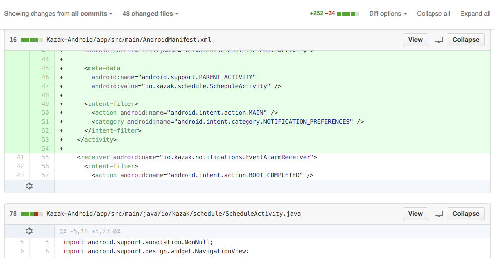

  chrome-github-sticky-headers
========================

[](https://chrome.google.com/webstore/detail/github-sticky-headers/gmilkdlfpkmfghknimmhhhjbagdbfnjf)
========================


> The first rule of classes is that they should be small.<br/>
> The second rule of classes is that they should be smaller than that.
>
> -- <cite>Robert C. Martin, Clean Code</cite>

...unfortunately this is not always the case.<br/>
This chrome extension help you reviewing those 1000 loc files having the current file header always visible while scrolling through the page.



##Development

You need to have NodeJS with `grunt-cli` and `bower` installed.

```shell
$ npm install -g grunt-cli bower
$ npm install
$ bower install
```

To debug the application with a live reload mechanism, run:

```shell
$ grunt debug
```

Then add the `app` folder as an unpacked extension in Chrome.

##License

```
   Copyright 2015 Daniele Bonaldo

   Licensed under the Apache License, Version 2.0 (the "License");
   you may not use this file except in compliance with the License.
   You may obtain a copy of the License at

     http://www.apache.org/licenses/LICENSE-2.0

   Unless required by applicable law or agreed to in writing, software
   distributed under the License is distributed on an "AS IS" BASIS,
   WITHOUT WARRANTIES OR CONDITIONS OF ANY KIND, either express or implied.
   See the License for the specific language governing permissions and
   limitations under the License.

```
